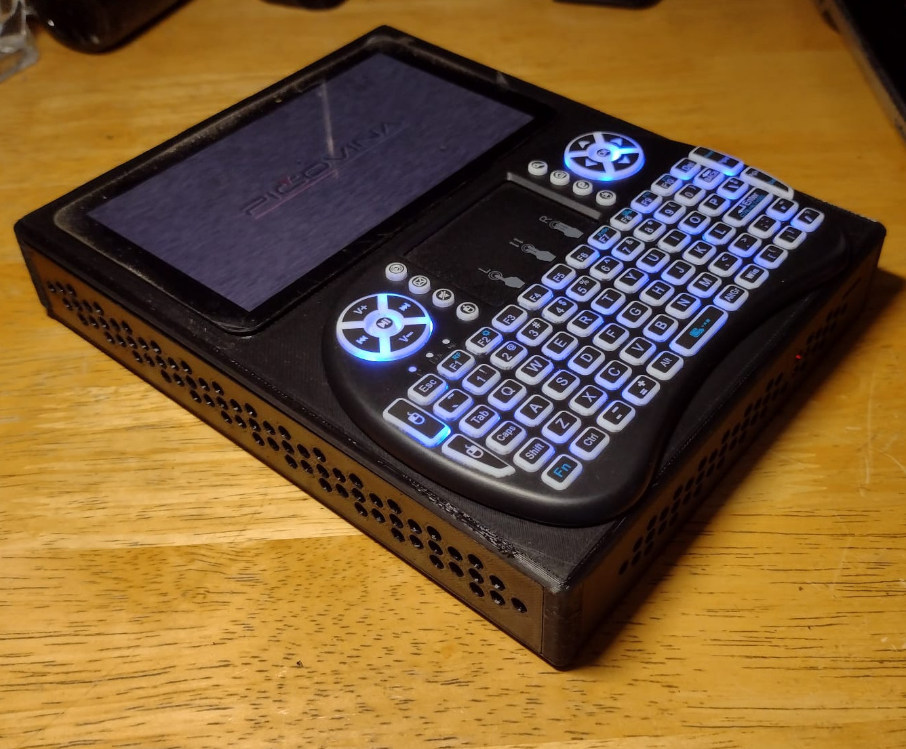

# picovina
A software suite for my custom cyberdeck project based on the **Orange Pi 5 MAX** running **Armbian**.

**Project name: "Pičovina"** (pronounced */pee-CHO-vi-na/*)

> The name comes from the prefix "Pi", commonly used for projects based on SBCs like Raspberry Pi, Orange Pi, etc. In my native language, the word “pičovina” can loosely mean “a somewhat useless thing,” although in this project I do see some practical use!

This repository will gradually include system configurations, kernel modules, scripts, services, and optimization guides as they become available. It is also adaptable to other single-board computers, such as Raspberry Pi, Radxa, and more.

*For a quick idea of the project setup – still in the very first functional version, but I have some new ideas for improvements*

# Armbian Postinstall
Post-installation steps after a fresh Armbian setup.

**Project folder:** [armbian-postinstall](./armbian-postinstall)

# pi-battery
A kernel module based on **rpi-integrated-battery**, paired with a battery monitoring service, designed for use with the Waveshare UPS 3S module featuring the INA219 chip.

**Project folder:** [pi-battery](./pi-battery)

# ag - apt-get Lazyfier
Because I'm quite lazy and commands like `apt-get install ...` can be long to type, I created a small script that simplifies working with apt, apt-get, or apt-cache commands.

**Project folder:** [apt-get Lazyfier](./ag)
